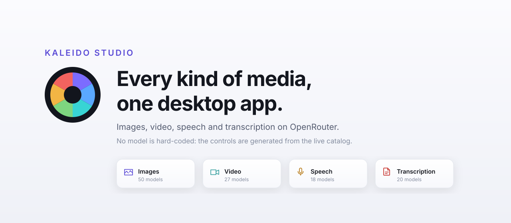
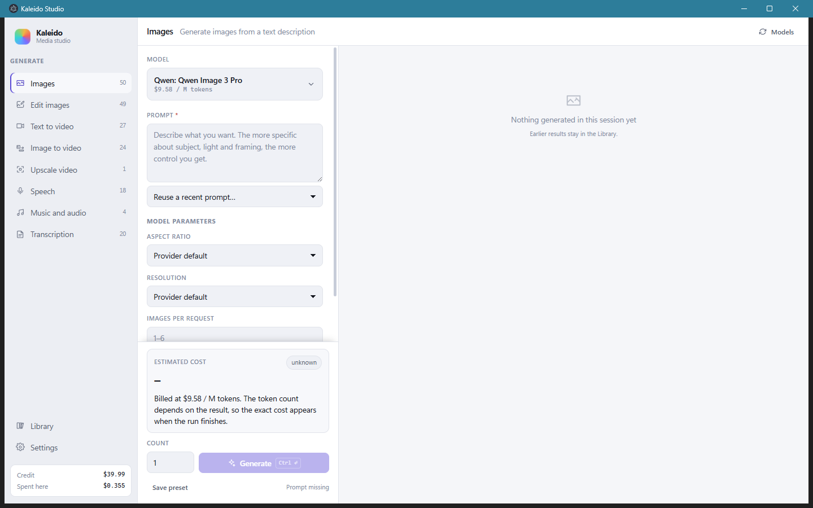
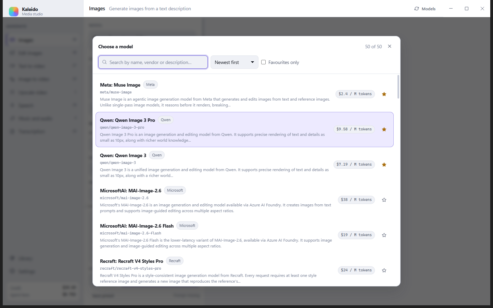

<div align="center">



# Kaleido Studio

**Ogni tipo di media, una sola app desktop.**
Immagini, video, voce e trascrizioni su OpenRouter, con i controlli generati dal catalogo dal vivo.

[](https://github.com/rlpb/kaleido-studio/actions/workflows/ci.yml)
[](https://github.com/rlpb/kaleido-studio/releases/latest)
[](LICENSE)
[](package.json)
[](#download)
[](https://ko-fi.com/rlpb_)

[Download](#download) · [Come funziona](#come-avviene-una-generazione) · [Costi](#costi) · [Sicurezza](#sicurezza-della-chiave) · [FAQ](#faq) · [English](README.md)

</div>

---

## Il problema

OpenRouter instrada un centinaio di modelli media: generazione e modifica di
immagini, video da testo, video da immagine, upscaling, voce, musica,
trascrizione. Ognuno accetta parametri diversi. Un modello per immagini prende
il formato e fino a cinque immagini di riferimento, un altro solo un livello di
risoluzione. I modelli video dichiarano ciascuno le proprie durate, risoluzioni
e se sanno generare audio. Ogni settimana ne compaiono di nuovi e i vecchi
cambiano.

Ogni client desktop per questa roba sceglie una manciata di modelli, ne cabla i
parametri in un form, e invecchia. Si finisce di nuovo in un terminale a
scrivere curl, oppure in un playground web senza libreria e senza traccia di
quanto è costato cosa.

Kaleido i parametri li legge da OpenRouter invece di cablarli.

<div align="center">

</div>

## Cosa fa

Otto modalità, ognuna appoggiata a un endpoint OpenRouter:

| Modalità | Produce | Endpoint |
|---|---|---|
| Immagini | Immagine da prompt | `POST /api/v1/images` |
| Modifica immagini | Immagine da prompt più immagini di riferimento | `POST /api/v1/images` |
| Video da testo | Video da prompt | `POST /api/v1/videos` |
| Video da immagine | Video da fotogramma iniziale ed eventualmente finale | `POST /api/v1/videos` |
| Migliora video | Versione a risoluzione più alta di un video esistente | `POST /api/v1/videos` |
| Voce | Parlato da testo, con voce selezionabile | `POST /api/v1/audio/speech` |
| Musica e audio | Traccia audio da una descrizione | `POST /api/v1/chat/completions` |
| Trascrizione | Testo da file audio, con timestamp opzionali | `POST /api/v1/audio/transcriptions` |

Più una coda con parallelismo configurabile, generazioni in lotto, una libreria
ricercabile di tutto il generato, preset salvati, cronologia dei prompt, modelli
preferiti, tema chiaro e scuro, e sette lingue di interfaccia. Ogni generazione
viene cronometrata dal momento in cui la richiesta parte, così l'attesa che un
modello costa si legge accanto al prezzo che costa.

**In "modifica immagini" compaiono solo i modelli che modificano davvero.**
Accettare un'immagine di riferimento e modificarla sono due capacità diverse, e
il catalogo non ha un campo che le separi: alcuni modelli usano l'immagine come
suggerimento di stile e restituiscono qualcosa che non c'entra, a prezzo pieno e
senza errori. Per distinguerli si leggono due segnali, perché presi da soli
falliscono entrambi: la descrizione del fornitore, e se un endpoint fattura
`input_image` per un'immagine che il modello consuma invece di `input_reference`
per una che si limita a guardare.

## L'idea su cui è costruito

Per ogni endpoint OpenRouter pubblica i parametri che ciascun modello accetta,
già tipizzati:

```json
// GET /api/v1/images/models
"supported_parameters": {
  "aspect_ratio": { "type": "enum", "values": ["1:1", "16:9", "9:16", "auto"] },
  "n":            { "type": "range", "min": 1, "max": 1 },
  "input_references": { "type": "range", "min": 0, "max": 5 }
}
```

```json
// GET /api/v1/videos/models
"supported_resolutions": ["768p", "480p"],
"supported_durations":   [5, 6, 7, 8, 9, 10],
"supported_frame_images": ["first_frame", "last_frame"],
"pricing_skus": { "duration_seconds_480p": "0.05", "duration_seconds_768p": "0.08" }
```

Kaleido normalizza queste tre forme diverse in un'unica struttura e da lì genera
il pannello dei controlli. Un modello nuovo, con parametri mai visti prima,
ottiene il suo form corretto senza che venga toccata una riga di codice. Quando
un provider aggiunge una manopola, la sua etichetta ripiega su quella fornita
dall'API invece di sparire.

<div align="center">

</div>

## Come avviene una generazione

1. Scegli una modalità, che fissa l'endpoint e il tipo di input richiesto.
2. Scegli un modello. Il catalogo viene riletto da OpenRouter a ogni avvio,
   quindi l'elenco è quello di oggi, non quello di quando è stato scritto questo
   file.
3. Il pannello viene costruito dai parametri dichiarati da quel modello.
4. La richiesta parte dal processo principale, mai dall'interfaccia, così la
   chiave API non entra mai nel renderer.
5. Il risultato finisce nella libreria con il prompt, i parametri e quanto è
   costato davvero.

Il video è asincrono: Kaleido invia il lavoro, interroga finché il provider non
ha finito, poi scarica il file. Tutto il resto è una singola richiesta sincrona.

## Costi

L'app distingue tre casi e dichiara a schermo in quale si trova, invece di
mostrare sempre un numero.

- **listino** — i video sono fatturati al secondo di output e la tariffa è nel
  catalogo, quindi la stima è aritmetica esatta: tariffa × durata × quantità.
- **misurato** — quasi tutte le altre modalità sono fatturate a token, e il
  numero di token dipende dal risultato. Se la stessa combinazione di modello e
  parametri è già stata eseguita, viene mostrato il costo reale di quella volta.
- **sconosciuto** — prima esecuzione di una combinazione. Viene mostrata la
  tariffa unitaria e detto esplicitamente che la cifra esatta arriva a fine
  generazione.

Il costo reale viene letto da `usage.cost` nella risposta, salvato con il file e
sommato nel contatore di spesa. Lo stimatore è deliberatamente incapace di
produrre un numero che non può ricavare dal catalogo o da una misura precedente,
e c'è un controllo che fallisce se dovesse iniziare a indovinare.

### Tariffe che il catalogo pubblica senza unità di misura

`pricing.prompt` contiene due unità diverse e l'API non dice mai quale. Un
modello che dichiara un contesto in token è fatturato a token:
`openai/gpt-4o-mini-transcribe` dichiara 128000 e riporta `0.00000125`, che è
esattamente il prezzo pubblicato da OpenAI di $1.25 per milione di token. Un
modello che dichiara `context_length: 0` è fatturato in altro modo:
`microsoft/mai-transcribe-2` dichiara 0 e riporta `0.1`, che la pagina del
modello su OpenRouter etichetta **Audio Hours … /hour**.

Nessuna rotta documentata pubblica quell'etichetta: `/api/v1/models`, la rotta
`/endpoints` e `?include=display_pricing` la omettono tutte. Quindi Kaleido
mostra quelle tariffe alla loro scala lasciando l'unità senza nome, invece di
moltiplicarle per un milione e chiamare il risultato prezzo per token. Nel
catalogo attuale sono trenta i modelli in questo caso, e un controllo fallisce se
uno di essi torna a essere etichettato come fatturato a token.


## Sicurezza della chiave

La chiave viene cifrata con il portachiavi del sistema operativo tramite
`safeStorage` di Electron: Gestione credenziali su Windows, Keychain su macOS,
`libsecret` su Linux. Viene salvata nella cartella dati dell'applicazione e non
lascia mai la macchina se non verso `openrouter.ai`.

Dove il portachiavi non è disponibile, Electron non fallisce: degrada in
silenzio. Kaleido registra il caso e lo dichiara nelle impostazioni con
l'etichetta *salvata in chiaro*, invece di lasciar credere che sia cifrata.

Il renderer gira con `contextIsolation`, `sandbox` e senza integrazione Node.
Non riceve mai la chiave e parla col processo principale solo tramite IPC
tipizzato. I file della libreria gli arrivano da un protocollo custom che
risolve il percorso richiesto e rifiuta qualunque cosa stia fuori dalla cartella
della libreria.

Nessuna telemetria, nessuna analitica, nessuna destinazione di rete oltre a
OpenRouter.

## Download

Gli installer per Windows, macOS e Linux sono compilati dalla
[CI](.github/workflows/release.yml) e allegati a ogni release.

**[Scarica l'ultima release](https://github.com/rlpb/kaleido-studio/releases/latest)**

| Piattaforma | File |
|---|---|
| Windows | installer `.exe`, oppure la versione portable |
| macOS | `.dmg`, Intel e Apple silicon |
| Linux | `.AppImage`, oppure `.deb` |

Le build non sono firmate. Windows SmartScreen e Gatekeeper su macOS mostrano un
avviso al primo avvio.

Ogni release porta un `SHA256SUMS.txt` prodotto dallo stesso workflow che ha
costruito gli installer, così puoi verificare che il file scaricato sia quello
che la CI ha creato:

```bash
sha256sum -c SHA256SUMS.txt --ignore-missing
```

Serve una [chiave API OpenRouter](https://openrouter.ai/keys). La incolli al
primo avvio e non viene chiesto altro.

### Oppure eseguilo dai sorgenti

```bash
git clone https://github.com/rlpb/kaleido-studio.git
cd kaleido-studio
npm install
npm start
```

Node.js 22 o superiore. Lo richiedono Electron e gli strumenti di build.

## Cosa Kaleido non è

- Non è un modello. Porta i prompt a OpenRouter e riporta indietro i file.
- Non è un proxy né un account. Chiave tua, credito tuo, termini tuoi con ogni
  provider.
- Non è un editor video. Genera e migliora, non taglia e non compone.
- Non è uno strumento 3D. OpenRouter non espone modelli con output 3D.

## FAQ

**Funziona senza un account OpenRouter?**
No. La chiave è l'unica cosa che l'app chiede, e ogni generazione viene
addebitata su di essa. I modelli marcati `free` non costano nulla ma la chiave
serve lo stesso.

**Dove finiscono i miei file?**
Nella cartella dati dell'applicazione, modificabile nelle impostazioni. I file
già scritti restano dove sono; cambiare cartella riguarda solo i successivi.

**Una generazione muore dopo circa un minuto. Perché?**
Le richieste di generazione restano silenziose mentre il modello lavora, e
qualunque cosa lungo il percorso chiuda le sessioni inattive le uccide. I nodi
di uscita delle VPN sono il caso più comune, e sessanta secondi è una regola
diffusa. L'app invia probe di keepalive TCP, che aiutano con alcuni gateway e
non con altri. Se continua a succedere, escludi l'app dal tunnel della VPN
oppure scegli un modello che risponde entro quella finestra. Il messaggio
d'errore dice in quale caso ti trovi e quanto è sopravvissuta la connessione.

**Perché un modello rifiuta il mio prompt e un altro lo accetta?**
Il filtro sui contenuti è del provider, non dell'app. Il rifiuto viene riportato
testualmente.

**Posso usare un modello che richiede la conferma dell'età?**
Sì, dopo averla data una volta nelle
[preferenze OpenRouter](https://openrouter.ai/settings/preferences).

**L'interfaccia è disponibile nella mia lingua?**
English, Italiano, Español, Français, Deutsch, Português e Русский. Al primo
avvio segue il sistema operativo. Nomi e descrizioni dei modelli restano come li
fornisce il catalogo.

## Com'è fatto

```
electron/
├── main.ts               finestra, IPC, protocollo media, menu
├── preload.ts            la superficie contextBridge che vede il renderer
├── openrouter.ts         client API e normalizzazione delle capability
├── keepalive-request.ts  il percorso HTTPS che arriva a setKeepAlive
├── jobs.ts               coda, costruzione richieste, polling video, salvataggio
├── store.ts              configurazione, chiave cifrata, preset, costi osservati
└── library.ts            file su disco e indice della libreria
src/
├── screens/              onboarding, studio, libreria, impostazioni
├── components/           selettore modelli, form generato, input, schede, viewer
└── lib/                  tipi condivisi, definizione modalità, prezzi, i18n
scripts/
├── selfcheck.mjs               verifica contro l'API dal vivo
├── validate-builder-config.mjs valida offline la configurazione di packaging
└── make-icon.mjs               genera l'icona, nessun binario nel repository
```

Electron con renderer React, CSS scritto a mano, nessun framework di
interfaccia. Il processo principale possiede ogni chiamata di rete e la chiave;
il renderer non possiede altro che pixel.

## Sviluppo

```bash
npm run dev           # Vite in hot reload più Electron
npm run typecheck     # TypeScript, strict
npm run check         # contro il catalogo OpenRouter reale
npm run check:config  # valida electron-builder.yml offline
npm run dist          # installer per il sistema operativo corrente
```

`npm run check` interroga le rotte pubbliche del catalogo senza chiave e
verifica che ogni modalità abbia modelli, che ogni parametro normalizzato sia
utilizzabile da un form, che i modelli video espongano durata e tariffa al
secondo, che la stima a listino coincida con tariffa × durata × quantità, che
una combinazione mai eseguita non produca un numero inventato, e che ogni prezzo
porti la sua valuta.

`npm run check:config` valida `electron-builder.yml` contro lo schema che
`app-builder-lib` spedisce. electron-builder valida la propria configurazione
come primo passo di un packaging, quindi una chiave sconosciuta farebbe altrimenti
fallire tutti e tre i job di piattaforma dopo minuti, con un messaggio che nomina
la sezione ma mai la chiave.

Leggi [CONTRIBUTING.md](CONTRIBUTING.md) prima di aprire una pull request.

## Sostieni il progetto

Kaleido Studio è gratuito e con licenza Apache 2.0, e così resta. Non c'è una
versione a pagamento e non c'è niente tenuto da parte. Se ti fa risparmiare
tempo, un caffè è un bel modo per dirlo.

<div align="center">
<a href="https://ko-fi.com/rlpb_"></a>
</div>

## Riconoscimenti

Kaleido Studio è una faccia per [OpenRouter](https://openrouter.ai), che fa la
parte difficile: instradare verso ogni provider, misurare, fatturare e offrire
una sola API su modelli che concordano su pochissimo. I modelli appartengono ai
rispettivi fornitori e hanno termini propri.

## Licenza

Apache 2.0. Vedi [LICENSE](LICENSE) e [NOTICE](NOTICE).

Puoi usare, modificare e ridistribuire Kaleido Studio, anche commercialmente.
Quello che la licenza chiede in cambio è che la nota di copyright, la licenza e
il file NOTICE viaggino con esso, e che si dichiari cosa è stato cambiato.

---

<div align="center">
<sub>Parole chiave: app desktop OpenRouter · generatore immagini AI · app da testo a video ·
da immagine a video · sintesi vocale AI · trascrizione audio · client AI Electron ·
generare immagini video e audio in una sola app</sub>
</div>
